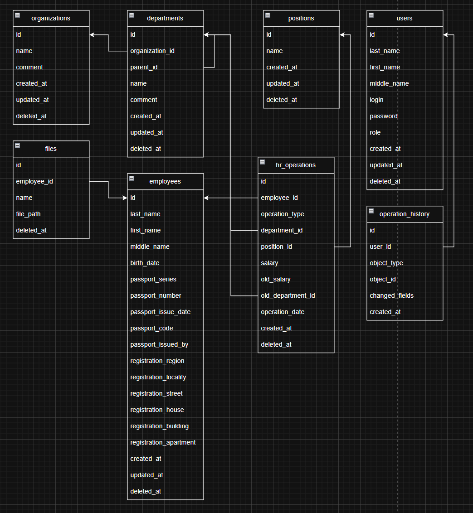

Неделя 1

1. Подготовлена схема базы данных в Draw.io

https://drive.google.com/file/d/15C70KAF0h7jtXzaa1V5edr2Ad6c45-44/view?usp=sharing

2. Подготовлена структура проекта

areal-hr-test-2026/
├── /api/................................
│   ├── /node_modules/...................
│   ├── /migrations/.....................
├── /app/................................
│   ├── /node_modules/...................
├── /containers/.........................
│   ├── /api/............................
│   │   ├── Dockerfile...................
│   ├── /app/............................
│   │   ├── Dockerfile...................
├── /docs/...............................
├── /.gitignore..........................
├── /.env................................
├── /.env.example........................
├── /docker-compose.yml..................
├── /README.md/..........................

3. Определиться с используемым инструментарием для реализации проекта (операционная система, IDE, как будет установлен PostgreSQL), зафиксировать эту информацию в файле README.md

Работаю на ос Windows 11, среда разработки - Visual Studio Code, PostgreSQL 18 + pgAdmin4 уже установлены.

4. Изучены инструменты по работе с системой контроля версий Git в консоли и в вашем IDE, информация об основных командах должна быть зафиксирована в файле README.md

git status - проверям статус, какие файлы изменены
git add README.md  - добавить определенный файл в коммит
git add . - добавить все файлы в коммит
git commit -m "имя коммита" - создание коммита
git push origin main - пушим изменения на гит
git pull origin main - копируем изменения с гита
git branch - список веток 
git branch <название-ветки> - создание ветки
git checkout <название-ветки> - переключаемся на ветку
