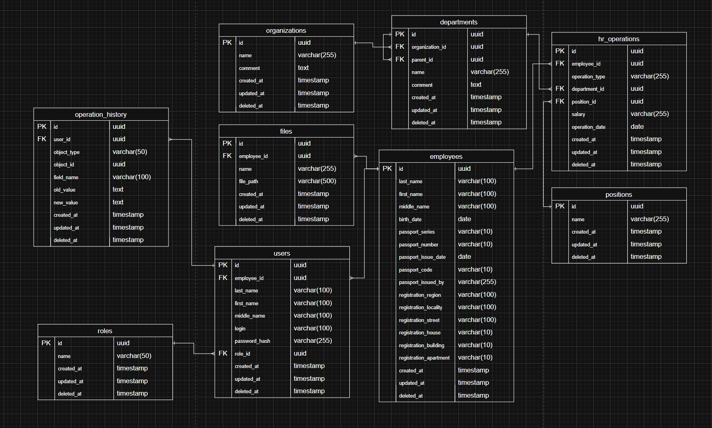

# HR-система для управления сотрудниками

Веб-приложение для ведения кадрового учёта сотрудников в нескольких организациях. Разработано в рамках производственной практики в ООО «Ареал».

---

## Быстрый запуск (через Docker)

Требования:
- Установленный Docker Desktop
- Включённый WSL 2 (для Windows)

Запуск:

    git clone https://github.com/ваш-логин/areal-hr-test-2025.git
    cd areal-hr-test-2025
    docker compose up --build

После запуска откройте браузер: http://localhost

Логин для входа: admin
Пароль: admin123

---

## Ручной запуск (без Docker)

Требования:
- Node.js (v22+)
- PostgreSQL (v17+)
- npm

1. База данных:
   Создайте базу данных hr_system и выполните миграции:
   
       cd api
       npm run migrate:up

2. Бэкенд (NestJS):
   
       cd api
       npm install
       npm run start:dev

3. Фронтенд (Vue 3):
   
       cd app
       npm install
       npm run dev

---

## Структура проекта

    areal-hr-test-2025/
    ├── api/
    │   ├── src/
    │   ├── migrations/
    │   ├── Dockerfile
    │   └── package.json
    ├── app/
    │   ├── src/
    │   ├── Dockerfile
    │   └── package.json
    ├── containers/
    ├── docs/
    ├── docker-compose.yml
    ├── .env.example
    └── README.md

---

## Основные возможности

- Организации: создание, редактирование, мягкое удаление
- Отделы: поддержка вложенной структуры (родитель-потомок)
- Должности: справочник должностей
- Сотрудники: ФИО, паспортные данные, адрес регистрации
- Кадровые операции: приём, увольнение, изменение зарплаты и отдела
- История изменений: автоматическая запись всех изменений
- Файлы: загрузка и скачивание сканов паспортов
- Пользователи: роли администратор и HR-менеджер
- Аутентификация: JWT, пароли хэшируются Argon2id

---

## Команды Docker

    docker compose up                 # запуск всех контейнеров
    docker compose up -d              # запуск в фоновом режиме
    docker compose down               # остановка
    docker compose down -v            # остановка с удалением томов
    docker compose logs api           # просмотр логов API
    docker compose restart api        # перезапуск API
    docker compose build --no-cache   # пересобрать образы

---

## Используемые технологии

- Бэкенд: NestJS, TypeORM, PostgreSQL
- Фронтенд: Vue 3, Pinia, Vue Router, Vite
- Аутентификация: JWT, Passport, Argon2id
- Контейнеризация: Docker, Docker Compose
- Документация: Draw.io

---

## Отчёт по неделям

Неделя 1:
- Схема базы данных в Draw.io

  Ссылка: https://drive.google.com/file/d/15C70KAF0h7jtXzaa1V5edr2Ad6c45-44/view?usp=sharing
- Структура проекта
- Инструментарий: Windows 11, VS Code, PostgreSQL 18 + pgAdmin 4
- Основные команды Git

Неделя 2:
- CRUD для организаций, отделов, должностей с мягким удалением

Неделя 3:
- CRUD для сотрудников, файлов, кадровых операций, истории изменений

Неделя 4:
- Отладка и исправление ошибок

Неделя 5:
- CRUD для пользователей, хэширование паролей Argon2id

Неделя 6:
- Фронтенд на Vue 3, JWT-аутентификация, защита маршрутов

Неделя 7-8:
- Dockerfile, docker-compose, запуск одной командой

---

## Основные команды Git

    git status              # проверить статус файлов
    git add <файл>          # добавить файл в коммит
    git add .               # добавить все файлы
    git commit -m "текст"   # создать коммит
    git push origin main    # отправить на GitHub
    git pull origin main    # скачать с GitHub
    git branch              # список веток
    git branch <название>   # создать ветку
    git checkout <название> # переключиться на ветку
    git checkout -b <название> # создать и переключиться

---

Учебный проект. Все права защищены.
